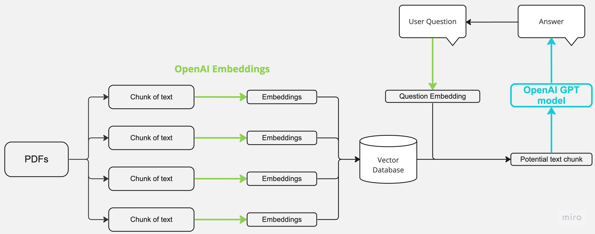

# LLM-QA-chatbot

A Retrieval-Augmented Generation (RAG) application that allows users to "chat" with PDF documents using OpenAI's GPT model and ConversationalRetrievalChain.

## Features

- **Dual Interface**: Web app (Streamlit) and Command-line interface
- **PDF Processing**: Extracts and processes text from multiple PDF files
- **Vector Search**: Uses OpenAI embeddings with FAISS for semantic search
- **Conversational Memory**: Maintains chat history using ConversationBufferMemory
- **RAG Pipeline**: Retrieves relevant context and generates accurate answers

## Architecture Flow



## Installation

1. **Clone the repository**
   ```bash
   git clone <repository-url>
   cd LLM-QA-chatbot
   ```

2. **Create virtual environment**
   ```bash
   python3 -m venv venv
   source venv/bin/activate  # On Windows: venv\Scripts\activate
   ```

3. **Install dependencies**
   ```bash
   pip install -r requirements_legacy.txt
   ```

4. **Set up OpenAI API key**
   ```bash
   # Create .env file in project root
   echo "OPENAI_API_KEY=your_api_key_here" > .env
   ```

## Usage

### Web Interface (Streamlit)
```bash
cd src
python app_p1.py
streamlit run app_p1.py
```
- Opens web interface at `http://localhost:8501`
- Upload PDFs using the sidebar
- Click "Process" to create embeddings
- Ask questions in the chat interface

### Command Line Interface
```bash
cd src
python app_p1.py cli
```
- Enter path to folder containing PDFs
- Processes all PDF files automatically
- Chat directly in terminal
- Type 'exit' to quit

## Core Process

1. **Load**: Extract text from PDF files using PyPDF2
2. **Chunk**: Split text into 500-character overlapping chunks
3. **Store**: Create OpenAI embeddings and store in FAISS vector database
4. **Retrieve & Generate**: Use ConversationalRetrievalChain to:
   - Search for relevant document chunks
   - Maintain conversation history
   - Generate contextual answers using GPT

## Requirements

- Python 3.8+
- OpenAI API key with available credits
- PDF files to process

## Dependencies

- `langchain==0.0.354` (legacy version with ConversationalRetrievalChain)
- `openai==0.28.1` (compatible with legacy LangChain)
- `streamlit` (web interface)
- `faiss-cpu` (vector database)
- `pypdf2` (PDF processing)